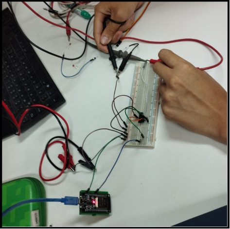
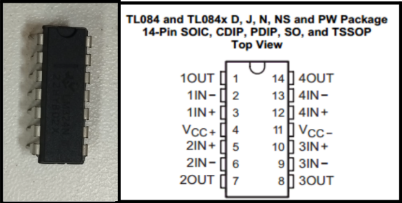
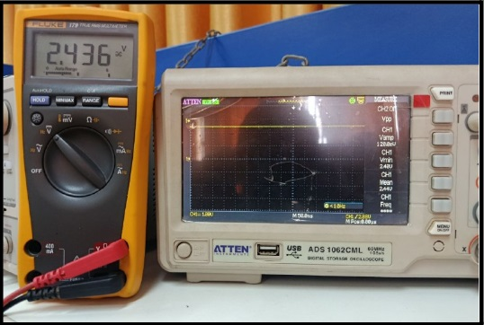
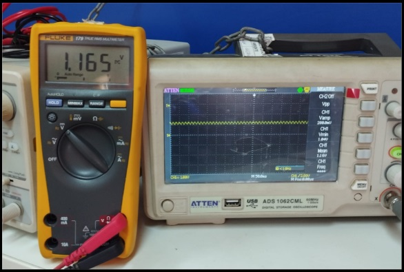
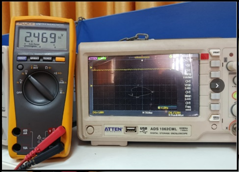

# Acondicionamiento de Señales de Alta Impedancia (Simulador de Electrodo de pH)

**Informe de Laboratorio N.º 1 — Instrumentación Biomédica III**  
*Escuela Profesional de Ingeniería Biomédica — Universidad Nacional Mayor de San Marcos (UNMSM)*

---

## 1. Resumen

En esta práctica se evaluó el acondicionamiento de señales provenientes de fuentes de muy alta impedancia, simulando la respuesta de un electrodo de pH mediante el periférico DAC (GPIO25) de un ESP32. Al intercalar una resistencia $R_1 = 1\text{ M}\Omega$ para modelar la impedancia del sensor, se observó un **error de carga (loading error) de entre 50% y 54%** al medir directamente con instrumental convencional (multímetro y osciloscopio). La implementación de una etapa de desacoplamiento tipo buffer (seguidor de voltaje) logró corregir eficazmente esta pérdida: el circuito con op-amp de entrada JFET (**TL084**) redujo el error a **< 4%**, mientras que el de entrada bipolar (**LM324**) lo redujo a **< 7%**, validando la teoría del divisor de tensión y la importancia de la alta impedancia de entrada en instrumentación clínica.

---

## 2. Diagramas del Sistema y Montaje

El flujo de señal comprende tres etapas consecutivas:
1. **Etapa 1:** Generación directa de la señal simulada por el DAC del ESP32.
2. **Etapa 2:** Evidencia del efecto de carga con $R_1 = 1\text{ M}\Omega$ intercalada (Nodo A).
3. **Etapa 3:** Corrección mediante el buffer de alta impedancia (Nodo B).

*Figura 1. Circuito buffer implementado en protoboard con el CI TL084, alimentado con fuente dual de ±9 V.*

---

## 3. Desarrollo Experimental y Medición

### Configuración del Operacional TL084
Para acondicionar la señal proveniente de la alta impedancia de la fuente sin drenar corriente, se utilizó la configuración seguidor de tensión con entrada JFET.

*Figura 2. Diagrama de pines del CI TL084 (Op-Amp de entrada JFET).*

### Comparativa de Mediciones por Etapas

*Figura 3. Medición en osciloscopio y multímetro de la señal generada para pH 4 sin resistencia intercalada (Etapa 1).*

*Figura 4. Atenuación del voltaje por efecto de carga al medir en el Nodo A tras $R_1 = 1\text{ M}\Omega$ sin buffer (Etapa 2).*

*Figura 5. Recuperación de la amplitud de la señal medida en el Nodo B a la salida del buffer TL084 (Etapa 3).*

---

## 4. Resultados y Análisis de Carga

### Tabla 1. Comparativa Global de Voltajes y Errores Porcentuales

| pH Simulado | V Teórico (V) | V Medido Etapa 1 (V) | V Medido Nodo A (Sin Buffer) | Error de Carga (%) | V Medido Buffer TL084 (V) | Error TL084 (%) | V Medido Buffer LM324 (V) | Error LM324 (%) |
| :---: | :---: | :---: | :---: | :---: | :---: | :---: | :---: | :---: |
| **pH 4** | 2.5374 | 2.436 | 1.165 | **54.09%** | 2.469 | **2.69%** | 2.475 | **2.46%** |
| **pH 7** | 1.6500 | 1.583 | 0.758 | **54.06%** | 1.602 | **2.91%** | 1.623 | **1.64%** |
| **pH 10** | 0.7626 | 0.772 | 0.364 | **52.27%** | 0.793 | **3.99%** | 0.813 | **6.61%** |

---

## 5. Materiales e Instrumental Utilizados

* **Placa de desarrollo:** ESP32 (Generador de señal de pH en GPIO25)
* **Circuito Integrado 1:** TL084N (Op-amp cuádruple con entrada JFET)
* **Circuito Integrado 2:** LM324N (Op-amp cuádruple con entrada Bipolar)
* **Componentes Pasivos:** Resistencia de $1\text{ M}\Omega$ ($\pm 5\%$), Capacitores cerámicos de $0.1\ \mu\text{F}$ (Desacoplo)
* **Alimentación:** Fuente de laboratorio dual $\pm 9\text{ V}$
* **Equipos de Medición:** Osciloscopio digital de banco y Multímetro digital

---

## 6. Integrantes

* **Dávila Pucuhuayla, Jazmín Sarai** — *Código: 23190369*
* **Leon Vasquez, Jimmy Fabricio** — *Código: 23190378*
* **More Quispe, Gregory Martin** — *Código: 23190125*
* **Maldonado Villacorta, Paola Margot** — *Código: 23190124*

**Docente:** María Elisia Armas Alvarado  
**Curso:** Instrumentación Biomédica III — Universidad Nacional Mayor de San Marcos
